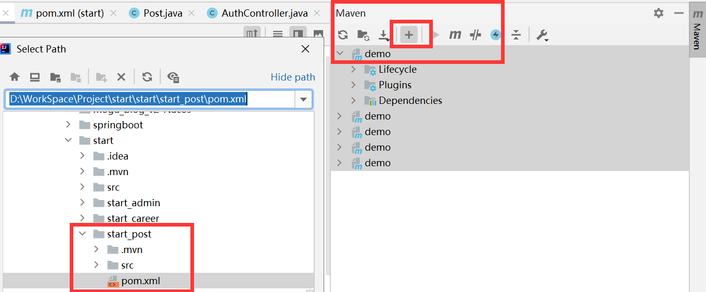

# 开发说明
* 如果有认为微服务设计等大结构上不合理的地方，请和大家协商如何修改，保证大家的协作；
* 如果认为有数据表等小结构上不合理的地方，请和功能可能涉及的负责人员协商修改，并进行必要的文档修改（影响开发的部分）
* 如果不影响开发，文档的修改可以延后

# 微服务启动

maven可以添加所有微服务下的pom.xml

每次在maven选中需要更新pom更新即可

# 微服务模块功能
微服务在代码层可以考虑service方法的复用

以下仅说明各模块逻辑功能
## admin
后台管理模块，单独一个微服务
* 用户管理
  * 显示用户详细信息
  * 增删改查
* 帖子管理
  * 删、查

## career
就业、升学信息&数据分析处理模块
* 就业记录、升学记录
  * 增删改查：在个人界面进行编辑，用户编辑个人去向，产生升学/就业记录
* 就业分析、升学分析

## post
问答、帖子、帖子评论模块

note：问答和帖子统一为

* 主动发帖
  * 帖子的增删改查；
  * 帖子的评论、二级评论
* 问答
  * 提问贴-评论模式，仅需一级评论
  * 问答的增删改查

## user
用户身份验证、用户个人界面
* 用户个人收藏：帖子和问答
* 用户个人设置
* 用户个人信息：展示（查找）、修改

